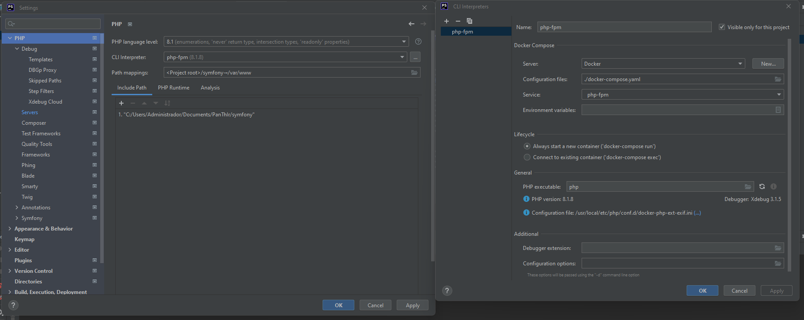
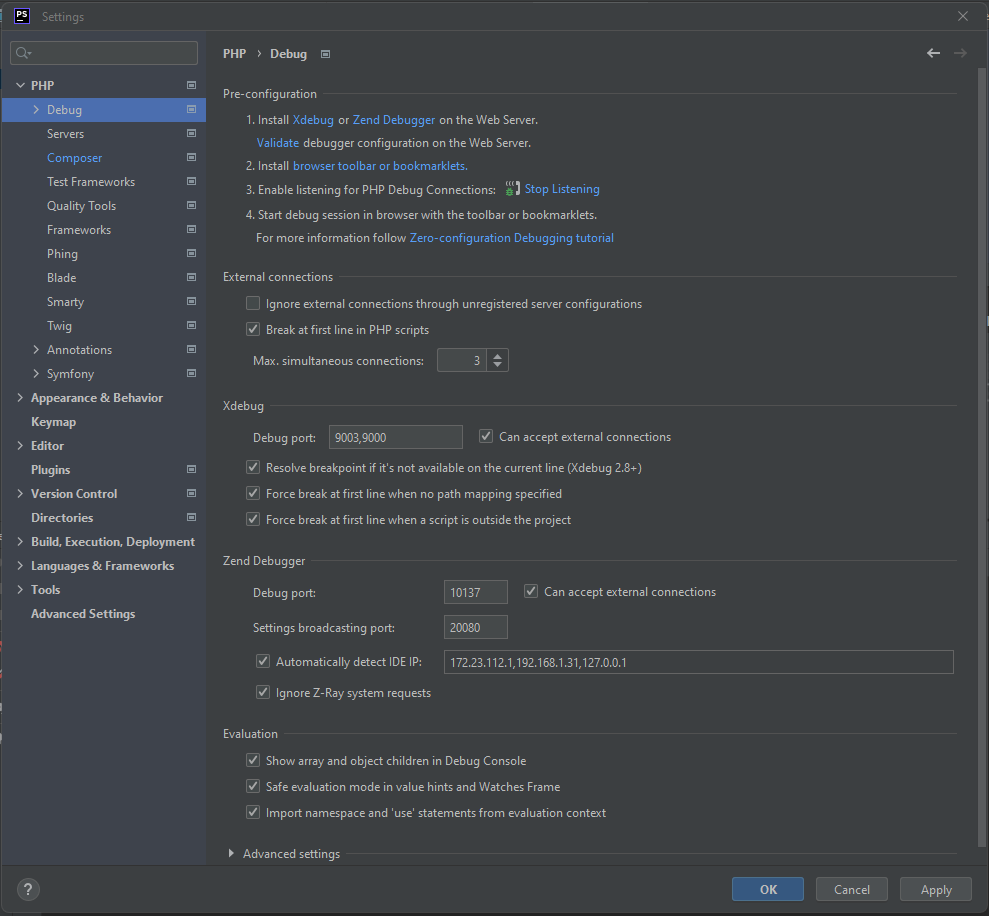

- [DevTools](#dev-tools)
  - [xdebug](#how-to-turn-on-xdebug-on-phpstorm)


## dev tools
There are some tools to keep the code quality and create some standards of coding.

*Some tools require to run some command inside a container*.

*So you can go to the* **project root** and run:
> docker-compose exec php-fpm bash

where "php-fpm" is the container name.

validate directory, classes and dependecy rules:

> vendor/bin/deptrac

Analyse possible bugs with
> vendor/bin/phpstan analyse src

> vendor/bin/php-cs-fixer fix src

### How to turn on xdebug on phpstorm
Configure a server at settings -> PHP -> Servers


Configure a CLI at settings -> PHP '...' button


Configure the xdebug at settings -> PHP -> Debug


now you can start to use xdebug

### Usefull commands
Run fixtures, --append is option to avoid removing old data. you can run by groups too: 

--group=group1 --group=group2
> php bin/console doctrine:fixtures:load --append

Run messenger, after the consume keyword you should specify which transport you want to run. 
-vv is optional for debugging
> php bin/console messenger:consume async

Run PHPUnit tests
> php bin/phpunit


### Implementation
Used symfony messenger component to create transactional command bus, query bus and event bus.
Query model represented by DTOs. Domain and Command layers are covered by unit tests.

```
├── Core (Core bounded context)
│   ├── Application
│   │   ├── Command
│   │   │   ├── AuthToken
│   │   │   ├── Task
│   │   │   └── User
│   │   ├── Query
│   │       └── Task
│   ├── Domain
│   │   └── Model
│   │       ├── Task
│   │       └── User
│   ├── Infrastructure
│   │   └── Repository
│   └── Ports
│       ├── Cli
│       └── Rest
└── Shared
    ├── Domain
    └── Infrastructure

```